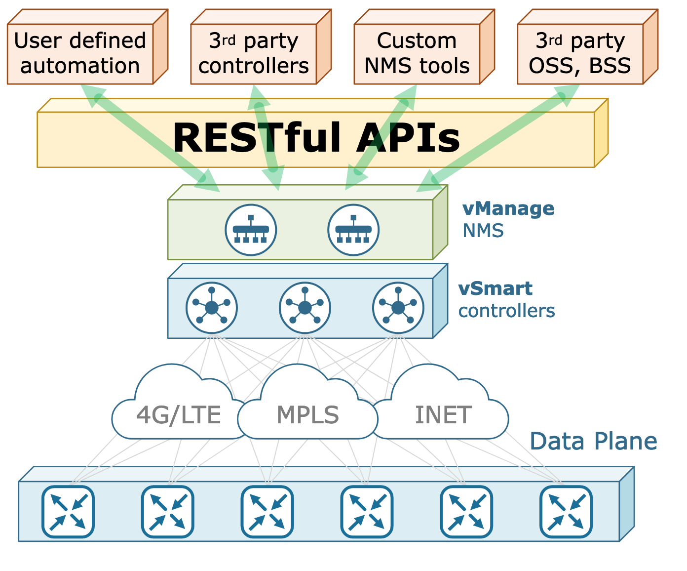

# SD-WAN APIs Integration

Cisco SD-WAN has been designed with automation and extensibility in mind. Cisco vManage provides northbound RESTful APIs that allow customers to build their own unique business logic on top of the SD-WAN solution. For example, enterprises can integrate their existing OSS (Operational Support System) and BSS (Billing Support System) tools and consume telemetry data, automate incident tickets creation and lifecycle, and automate the deployment of new services.

The northbound APIs open a new world of possibilities to network engineers as well. Many trivial operational tasks that consume lots of time and effort in a large-scale environment can be easily automated. For example, configuration audits, network/security audits, inventory reports, automated backup/restore, 3rd-party tools integration, and so on.



## Requirements

To use this code you will need:

* Python 3.7+
* vManage user login details.

## Install and Setup

- Clone the code to local machine.

```
git clone https://github.com/sbarissonmez/sd-wan_api_integration.git
cd sd-wan_api_integration
```
- Setup Python Virtual Environment (requires Python 3.7+)

```
python3.7 -m venv venv
source venv/bin/activate
pip3 install -r requirements.txt
```

- Create **vmanage_login.yaml** using below sample format to provide the login details of vManage

## Example:

```
# vManage Connectivity Info
vmanage_host:
vmanage_port:
vmanage_username:
vmanage_password:
```
